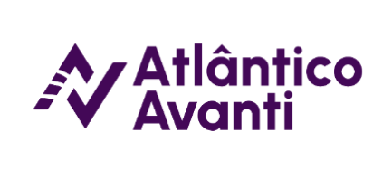

 

<h1 align="center">Atlântico Avanti - Desenvolvimento FullStack</h1>
<h4 align="center">Capacitação de profissionais e estudantes, com foco em aplicações reais, utilizando conceitos de arquitetura de software e os frameworks mais populares. Aprenda a desenvolver aplicações computacionais em múltiplas plataformas.</h4>

<h3 align="center">
Tecnologias em Desenvolvimento Web

&nbsp;

</h3>

## Projetos / Desafios de Código

> A ser concluído de acordo com o progresso do Bootcamp

## Anotações: 

> A ser concluído de acordo com o progresso do Bootcamp